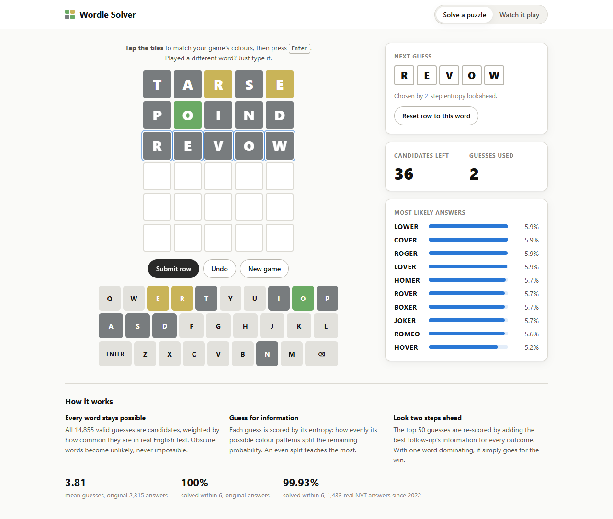
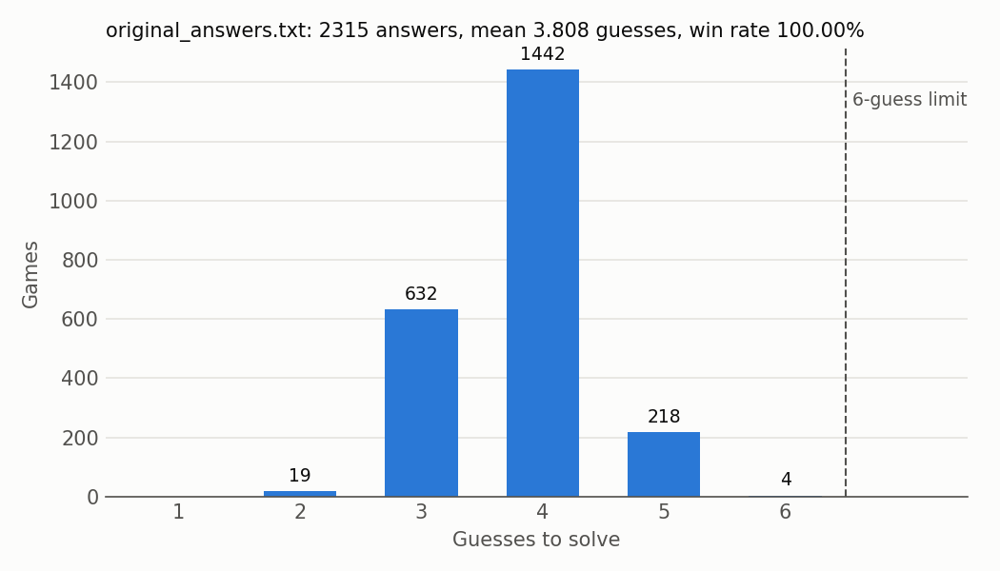
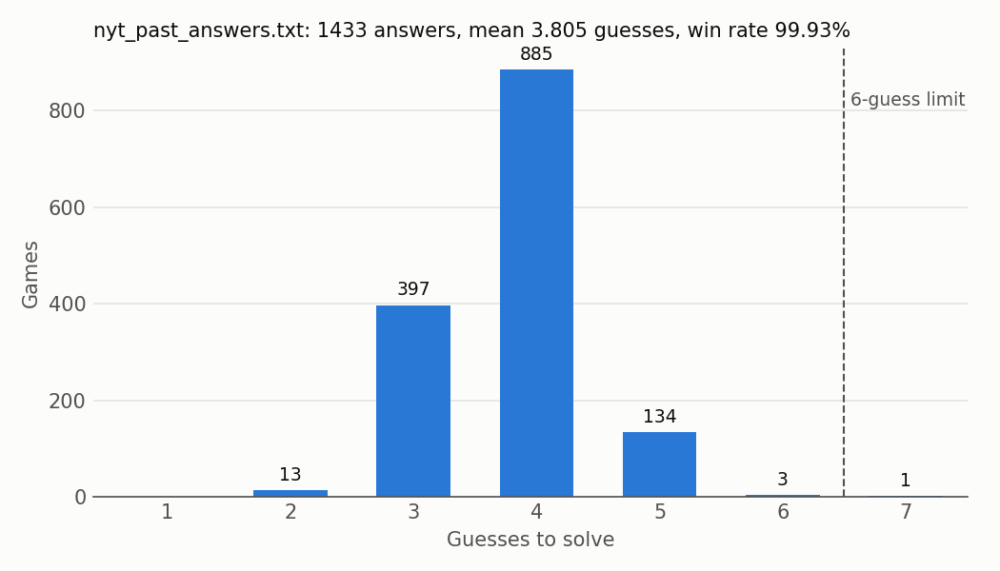

# Wordle Solver

An AI system that solves the New York Times Wordle in as few guesses as possible. It keeps a
**weighted set of candidate answers**, uses the colour feedback from each guess to rule out
impossible words, and picks every next guess with a **2-step lookahead search scored by entropy**
(expected information).

| AI idea | Where it appears |
|---|---|
| Constraint-based logic | Filtering out every word that is inconsistent with the feedback |
| Pattern matching | Computing the green/yellow/gray pattern for a guess against an answer |
| Probability | A prior over answers and Shannon entropy of the feedback distribution |
| Search | Looking two guesses ahead before choosing |
| NLP | Real-world word frequencies from a large English corpus, used as the prior |



## 1. The problem

The hidden answer is a 5-letter English word and the player has 6 guesses, each of which must be
in the game's dictionary of allowed guesses. After every guess each letter is coloured:

- **Green**: right letter, right position.
- **Yellow**: the letter is in the answer, but somewhere else.
- **Gray**: the letter is not in the answer, or every copy of it in the answer has already been
  accounted for by other tiles.

### Why the candidate set is weighted rather than fixed

The original 2021 game had a fixed list of 2,315 answers, and many solvers restrict their search
to it. Since November 2022 an NYT editor has chosen the answers, and some come from outside that
list: of the 1,433 distinct answers from November 2022 to October 2026, **64 are not in the
original list** (for example USURY, KEFIR, EMOJI and SNAFU).

So the candidates here are the **entire allowed-guess dictionary (14,855 words)**. Each word gets a
**prior probability** of being the answer, based on how common it is in English text. Everyday
words are likely, obscure words like XYLYL are unlikely, and **no word is ever impossible**. Only
feedback rules a word out. Past answers stay in because the NYT may reuse them.

## 2. How it works

### 2.1 Feedback: the two-pass duplicate-letter rule (`feedback.py`)

1. **Greens first.** Mark every position where the guess letter equals the answer letter, and count
   the answer letters that were *not* matched.
2. **Then yellows, left to right.** For each non-green position, if that letter still has a count
   above zero, mark it yellow and decrease the count. Otherwise mark it gray.

**Worked example: guess BABES, answer ABBEY.**

| Position | 1 | 2 | 3 | 4 | 5 |
|---|---|---|---|---|---|
| Guess | B | A | B | E | S |
| Answer | A | B | B | E | Y |

- Pass 1: positions 3 (B) and 4 (E) are **green**. The leftover answer letters are A, B and Y.
- Pass 2: position 1 (B) uses up the leftover B, so it is **yellow**. Position 2 (A) is **yellow**.
  Position 5 (S) is not in the answer, so it is **gray**.

Result: **Y Y G G B**. By contrast, SPEED against ABIDE gives **B B Y B Y**: ABIDE has only one E,
so only the first E is coloured.

A pattern is stored as one number from 0 to 242 in base 3 (gray=0, yellow=1, green=2, first letter
as the lowest digit), so all green is 242. Patterns are typed as strings such as `GYBBG`.

### 2.2 Pattern matrix and filtering (`pattern_matrix.py`, `state.py`)

The feedback for every (guess, possible answer) pair is computed once:
`M[g, c] = feedback(guesses[g], candidates[c])`. That is a 14,855 × 14,855 `uint8` matrix of
about 210 MB, built with vectorised NumPy in about 70 seconds and cached to
`data/cache/pattern_matrix.npy`. A hash of the word list is stored alongside it, and the matrix is
rebuilt automatically if the list changes. Everything else reads from `M` instead of calling
`feedback()`.

**Filtering** is one rule. After guessing *g* and seeing pattern *k*, keep exactly the candidates
*c* with `M[g, c] == k`. This enforces every green, yellow and gray constraint. If nothing
survives, an `InconsistentFeedbackError` is raised, which in practice means the colours were
entered wrong.

### 2.3 Priors from word frequency: the NLP component (`priors.py`)

1. **Frequency.** [`wordfreq`](https://pypi.org/project/wordfreq/) gives each word's **Zipf
   frequency**: log₁₀ of how often it appears per billion words of English text. "about" scores
   6.4, "crane" 3.9, and an unseen word 0.
2. **Sigmoid.** Weight `w = sigmoid((zipf − 2.5) / 0.4)`.
   - **Center 2.5.** 95% of the original answers have Zipf above 2.3 (median 3.5), while 34% of the
     dictionary has Zipf 0 and its 75th percentile is 2.65. 2.5 sits at that boundary. The
     editor's newer answers (median about 2.6) still get substantial weight.
   - **Width 0.4.** One Zipf unit (10× more frequent) moves the weight from 0.08 (at 1.5) to 0.92
     (at 3.5). Common words all end up near 1, so the search, not small frequency differences,
     decides between them. An unseen word gets about 0.002, roughly 500× less.
3. **Floor.** `w = max(w, 1e-4)`, so no word can ever have zero probability.
4. **Plural penalty ×0.1.** This applies to words ending in S (but not SS) whose stem, without the
   S or ES, is an English word. The dictionary has only 5-letter words, so a stem counts as English
   if its Zipf frequency in `wordfreq` is at least 2.0. This flags 2,878 words such as HOPES and
   BOXES. The threshold stops BASIS, MINUS and VIRUS from being penalised because of rare strings
   like "basi". Penalised words stay candidates.
5. The weights are **normalised** and cached to `data/cache/priors.npy`.

### 2.4 Weighted entropy (`entropy.py`)

A good guess is one whose feedback you cannot predict. For guess *g*, group the candidates by the
pattern they would produce, and let *p_k* be the share of prior weight in group *k*:

  **H(g) = − Σ_k p_k · log₂ p_k**  (bits)

Splitting the candidates into 8 equally likely groups gives H = 3 bits. Putting them all in one
group gives H = 0. Group weights come from `np.bincount(M[g, cands], weights=w, minlength=243)`,
computed for thousands of guesses at once. Guesses come from the **whole** dictionary, because a
word that cannot be the answer often splits the candidates better.

### 2.5 Choosing a guess: 2-step lookahead (`lookahead.py`)

1. **Shortlist.** Rank every allowed guess by H and keep the top **K1 = 50**.
2. **Simulate feedback.** For each shortlisted *g1*, split the candidates into pattern groups with
   probabilities *p_k*.
3. **Best follow-up.** For each group of 3 or more candidates, find **H_best(k)**, the highest
   entropy any guess achieves on that group. Groups of 1 or 2 contribute 0. The specification's
   "keep the top K2 = 50 and take the maximum" equals the maximum, so the code takes it directly.
4. **Score.** `Score(g1) = H(g1) + Σ_k p_k · H_best(k)`, then play the highest-scoring *g1*.

**Endgame rule.** When **2 or fewer** candidates remain, or the most likely one holds **at least
50%** of the weight, guess the most likely candidate.

**Speed.** Step 3 needs the entropy of all 14,855 guesses on up to ~160 groups for each of 50
shortlisted guesses. `grouped_guess_entropies` handles all groups of one *g1* in a single pass. It
sorts each guess's patterns by (group, pattern) and uses
H = log₂ T − (1/T) · Σ_k W_k log₂ W_k, where T is the group's total weight and W_k the weight of
each pattern within it. That is 5–10× faster than one call per group, with identical results
(tested to 1e-9). Zero-entropy guesses are never shortlisted: they cannot make progress, and
rounding could otherwise let one tie the best score and repeat forever.

**Opening-move cache.** The first guess never changes, and the second depends only on the first
feedback. `precompute` computes both once (6 processes, about 9 minutes) and stores them in
`data/cache/opening_moves.json`. The best opening is **TARSE**.

### 2.6 Solver loop (`solver.py`)

`Solver.simulate(answer)` repeats guess → look up the pattern in `M` → filter until the answer is
found, continuing past 6 guesses. The evaluation counts those games as losses. A `Game` keeps a
stack of candidate states, so undo just pops the last one.

## 3. Data

| File | Contents | Source |
|---|---|---|
| `data/allowed_guesses.txt` | 14,855 valid guesses | [tabatkins/wordle-list](https://github.com/tabatkins/wordle-list), from the game's source code |
| `data/original_answers.txt` | The original 2,315 answers (evaluation only) | [cfreshman's gist](https://gist.github.com/cfreshman/a03ef2cba789d8cf00c08f767e0fad7b) |
| `data/nyt_past_answers.txt` | 1,433 real answers, 2022-11-01 to 2026-10-05 (evaluation only) | NYT endpoint `https://www.nytimes.com/svc/wordle/v2/YYYY-MM-DD.json` |

`words.py` checks that every line is exactly 5 letters a–z, reports duplicates, and checks that
every answer is in the allowed list. All three checks pass. The answer lists are used **only for
evaluation**. The solver never restricts its candidates to them or looks up a date's answer.

## 4. Usage

Requires Python 3.10+.

```bash
python -m pip install -r requirements.txt
python -m pip install -e .
wordle precompute            # builds the caches once (about 10 minutes)
```

| Command | What it does |
|---|---|
| `wordle ui` | Web interface at http://127.0.0.1:7860 |
| `wordle play` | Terminal helper for today's puzzle: enter your word and its colours (`G`/`Y`/`B`); `undo` and `quit` work at any prompt |
| `wordle simulate --answer mocha` | Watch the solver play a known answer |
| `wordle evaluate` | Re-run the benchmark (about 15 minutes) and rewrite `results/` |
| `pytest` | Run the tests |

In the web interface, **Solve a puzzle** puts the suggested word in the current row. Play it in
your game, tap each tile until it matches your game's colour, and press Enter, or type a different
word if you played one. **Watch it play** shows the solver's game for any answer.

## 5. Results

Every answer in both lists was simulated against the full 14,855-word candidate set.

| Answer list | Games | Mean guesses | Win rate (≤ 6) | Worst case | Mean time / game | Failed |
|---|---|---|---|---|---|---|
| Original answers (2021) | 2,315 | **3.808** | **100.00%** | 6 | 1.14 s | none |
| Real NYT answers, Nov 2022 – Oct 2026 | 1,433 | **3.805** | **99.93%** | 7 | 0.90 s | GOFER |

| Guesses | 2 | 3 | 4 | 5 | 6 | 7 |
|---|---|---|---|---|---|---|
| Original answers | 19 | 632 | 1,442 | 218 | 4 | 0 |
| Real NYT answers | 13 | 397 | 885 | 134 | 3 | 1 |





Per-game results are in `results/original_answers.csv` and `results/nyt_past_answers.csv`.

### Where the solver struggles

- **Obscure answers.** The one loss is **GOFER** (Zipf 1.69): TARSE → POIND → REVOW → CHOKY →
  BOXER → GOMER → GOFER. The prior ranked commoner _O_ER words above it. GUNKY (Zipf 1.42) needed 6
  for the same reason. The 64 answers outside the original list average **3.95** guesses against
  **3.80** for the rest. That is the price of a frequency prior: it bets against rare words.
- **Letter-swap families.** FOLLY and JOLLY (6 each) share a pattern with DOLLY, GOLLY, HOLLY and
  more, and no single guess can test every option. NINNY and SOWER (6 each) are similar.
- **Names in the prior.** ROGER, HOMER and ROMEO are common in text mainly as names, so they get
  high weight despite being unlikely answers.
- **Common words look equal.** The sigmoid saturates above about Zipf 3.5, so the top candidates
  often show identical probabilities. This is intended: the search, not the prior, separates
  everyday words.

## 6. Deployment (Render)

The web server (`webapp.py`) is stateless. The browser sends the game so far with each request,
and the server replays it and caches suggestions by position. It holds the pattern matrix as a
read-only memory map and peaks at about 300 MB, so it fits Render's free 512 MB instance. Beyond
the opening cache, the web server limits the lookahead to **6 seconds** and keeps the best guess
found so far. The CLI and the evaluation always run the full search.

The `Dockerfile` installs `requirements-web.txt`, rebuilds the pattern matrix during the build, and
serves on `$PORT`. The pattern matrix is not stored in git.

1. Push this repository to GitHub.
2. On [render.com](https://render.com), sign in with GitHub and choose **New → Web Service**.
3. Select the repository. Render detects the Dockerfile: **Language: Docker**, **Branch: main**,
   **Root Directory:** leave blank.
4. Choose an **Instance Type**. Free works, but it sleeps after about 15 minutes idle, takes around
   a minute to wake, and has a small CPU share, so suggestions are slower.
5. Under **Advanced**, set **Health Check Path** to `/api/health`.
6. Click **Create Web Service**. The first build takes a few minutes. The site is then live at
   `https://<service-name>.onrender.com`, and every push to `main` redeploys it.

To run the same container locally: `docker build -t wordle-solver .` then
`docker run -p 7860:7860 wordle-solver`.

## 7. Project layout

```text
wordle_solver/
  src/wordle/
    words.py            word lists: loading and validation
    feedback.py         feedback rule and pattern encoding
    pattern_matrix.py   guess x candidate pattern matrix (cached)
    priors.py           word-frequency priors (cached)
    state.py            weighted candidate set and filtering
    entropy.py          weighted entropy, single and grouped
    lookahead.py        2-step lookahead and endgame rule
    solver.py           solver, game with undo, opening-move cache
    cli.py              ui / play / simulate / evaluate / precompute
    evaluate.py         benchmark, CSVs and histograms
    webapp.py           FastAPI server for the web interface
    static/index.html   web interface
  tests/                pytest suite
  data/                 word lists; cache/ holds priors, opening moves and (untracked) the matrix
  results/              evaluation CSVs and histograms
  docs/ui.png           screenshot used above
  Dockerfile            container for deployment
  requirements-web.txt  server dependencies
  requirements.txt      all dependencies, including plots and tests
```
